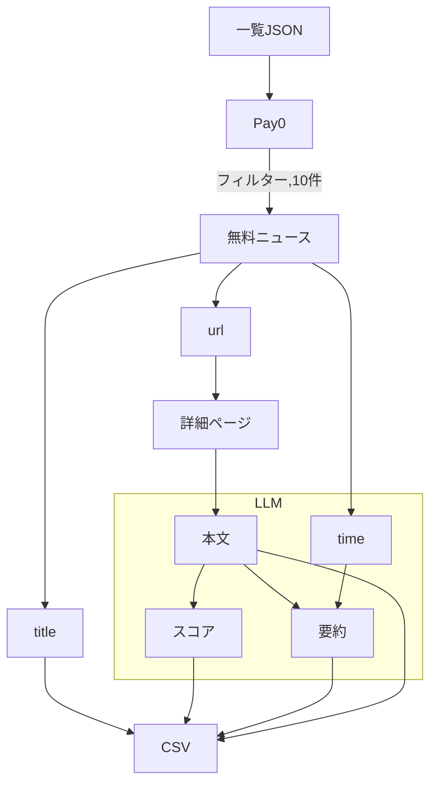

# news-risk-scorer

地方紙記事の自動収集と、LLMによるリスクスコアリング・パイプライン。 

> インターンシップ課題として着手し、その後個人で検証・改善を継続しています。

## 実行環境

```python
python --version
>>>Python 3.14.6
```

#### 必要なライブラリ

```python
pip freeze
>>>beautifulsoup4==4.14.3
>>>google-genai==2.17.0
>>>pandas==3.0.5
>>>pydantic==2.13.4
>>>requests==2.34.2
```

#### APIキーの設定

```python
export GEMINI_API_KEY="YOUR_API_KEY"
```

#### 実行コマンド

```python
python3 SourceCode.py
```

## ファイル構成

```SourceCode.py
SourceCode.py
```

> ソースコードを入れたpythonファイル

> スクレイピング・採点・出力を一括で行うスクリプト。
> 神戸新聞「事件・事故」欄の一覧JSONから無料記事10件を選び、
> 各記事の詳細ページから本文を取得し、
> LLMにリスクスコアと要約を生成させ、CSVに出力する。

```
kobe_news_riskscore.csv
```

> SourceCode.pyの実行によって生成される出力ファイルです。
> タイトル・リスクスコア・要約・本文の4列で構成される。

### 処理の流れ

 （一覧JSON → 無料フィルタ → 記事ページ → 本文 → LLM → CSV） 

1. 神戸新聞の一覧ページJSONファイルから「pay = 0」で無料記事の部分を探り出す
2. 一覧JSON無料記事のところからタイトル、url、配信時間を取る。
3. urlと神戸新聞のurlを合成して、無料記事の詳細ページのフルーリンクを手に入れる
4. 詳細ページで記事本文を手に入れる
5. 記事本文と配信時間をLLMに渡して、リスクスコアと要約を書いてもらう
6. タイトル、リスクスコア、要約、本文を集めて、CSVで出力する





### 設計上の判断

- なぜJSON APIを使ったか 

  > 神戸新聞の事件一覧ページには13件のページを載せている。その中に無料と有料記事が混ざってるというのが現状でした。「もっと見る」というボタンもある。クリックし続けたら無限に記事が出てくるという結果が観察できた。
  >
  > 一覧ページのHTML構造を分析した結果、13件の記事が全部置いていた。「もっと見る」というバタンの構造は非同期処理になっている。
  >
  > 置いていた記事の具体的な状況は、無料記事ならurlから詳細ページに入って、本文が置いてるので取れるのだが、有料記事は本文が載せてない。なので、有料記事自体は分析に使えないと判断した。
  >
  > 一覧ページの無料と有料記事の数を観察したら、ときによって有料記事の数が3件を超える場合があるので、一覧ページから確実に10件の無料記事を取ることが難しいと判断した。
  >
  > 非同期処理からなら、最初の13件の記事も含めて、400件の記事があるので、JSONファイルを直接利用することにした。

- なぜAgentではなくパイプラインか 

  > Agent（LLM）は上手な部分（曖昧な情報への判断）と下手な部分（ハルシネーション）があるので、今回の課題においては確実性のある手段をとった。LLMの理由に関しても極力ハルシネーションを抑える設計をした。
  >
  > 大規模なデータをスクレイピングで取りたい場合でも、Agentに任せるのが確実性が低い欠点がある。

- robots.txt の確認と判断

  > robots.txtを確認した結果、「User-agent」への規制がなく、「GPTBot」・「CCBot」・「Google-Extended」等のAIクローラーは全面拒否されており、コンテンツのAI利用に消極的な姿勢が読み取れる。
  >
  > 本スクリプトはサーバーへの配慮として、User-Agentを明示し、リクエスト間に待機を入れているなど施策を実施した。

- ( リスクスコア出力 ) プロンプトの設計思想

  > 最初に決められた「被害範囲・被害程度・社会的影響・死傷者や被害金額」４つ項目はそのままLLMに渡すと1〜100点という広い範囲に対して判断基準が曖昧になり、信頼性が低くなる。
  >
  > そのため、点数帯に意味を与えた採点表を設計した。
  >
  > - 記事のタイプを分類する：
  >   第一報型・処理型・続報型という三つに分類し、持続的な影響から考え、続報型に高点数をようにした。
  > - 評価を「A. 被害・影響規模」、「B. 帰責性・社会的非難度」、「C. 地域的共鳴・話題性」、「D. 未完結性・継続リスク」という４軸に分ける：
  > - A. 被害・影響規模：
  >   - 出典：災害学
  >   - 項目：A-1： 人的被害 　A-2： 波及規模　A-3： 物的被害
  >   - LLMの点数の決め方：A-1、A-2、A-3をそれぞれ出力してもらう
  >     - Pythonによる計算式： A = max(A-1, A-2) + A-3 （上限 100）
  >     - 理由：人身被害を伴う事故は、ほぼ必ず何らかの波及も持つので、A-1とA-2で高いほうを取ると現場の酷さが現れる。
  > - B. 帰責性・社会的非難度：
  >   - 出典：危機管理論の SCCT
  >     - 帰属の明確さ（事故/過失/故意）が世論の烈度を決める
  >   - 項目：B-1：帰責構造　B-2：犯罪類型の非難度
  >   - LLMの点数の決め方：点数帯
  >     - それぞれの小項目をパターン分けにして、それぞれの点数帯を先に選んでもらい、その後具体的な点をつけてもらう。
  > - C. 地域的共鳴・話題性：
  >   - 項目：C-1：被害者属性　C-2：場所　C-3：全国的文脈との接続　C-4：県内共通の地域課題との接続
  >   - 出典：ニュース価値論
  >     - 「識別可能な犠牲者効果」と近接性。なぜこの出来事が選ばれ、大きく扱われるのかを説明する系譜です。
  >   - LLMの点数の決め方：加点制
  >     - 他の軸よりは該当しないことが頻出なので、象徴的な文脈から選ぶような仕組みをした。
  > - D. 未完結性・継続リスク：
  >   - 出典：神戸新聞の特性から帰納的に作った
  >     - 記事によって「容疑を認めている」記事と「原因を調べている」記事の差が、被害規模より効いていると気づいた。つまり D は議題設定の持続時間を短報から予測しようとしてる
  >   - 項目：なし。
  >   - LLMの点数の決め方：点数帯
  >     - 新聞社の紙面制作の実務ルールから、ある事件について、今後もう一本記事が出る確率をリスクスコアに入れようとしてる仕組みである。
  > - 最終スコは４軸の加重和
  >   - スコア＝0.30A + 0.30B + 0.20C + 0.20D
  >   - 理由：均衡性が保てる。一つの軸の低さは、他の軸の高さで埋め合わせできる。ハルシネーションを防ぐために最終的な合計計算はpython側に回した。
  >
  > * パターン分けし、点数帯をLLMに与える
  >   * パターンなしで、実行してみた結果、採点ルールと食い違った結果が出たので、いきなり出力でなく、段階的に取り組みとして仕組みである。
  > * 構造化出力、および出力順番：
  >   * 調べた情報によってGemini APIが対応することがわかったので、情報の取り扱いの易さとハルシネーション防ぎの観点からそれを採用した。
  >   * LLMはtoken順に出力する特徴があるので、先に理由、次に点数という思考ロジックをプロンプト出力側で強制的にやらせた。

  > 本プロンプト、設計にあたっては生成AIを補助に用いたが、対象コーパスに合わせた較正はすべて実記事の読み込みに基づいて行った。

### 既知の限界

#### 設計上の限界

- スコアの配点の妥当性を検証していない（厳密に言えば実際の統計データを引用すべき）
- 帯の検証がコードに入っていない
  - `b_range` / `d_range` を出力させているが、Python 側で範囲内かを確認していない。

#### 外部要因

- サイト構造への依存
  - HTMLのclass名が変われば動かなくなる。JSONのURLは公開APIではなく、予告なく変わりうる。
- robots.txt の解釈
  - `User-agent: *` が無く明示的な禁止はないが、AIクローラーは全面拒否されている。規模と用途が変われば再検討が必要。